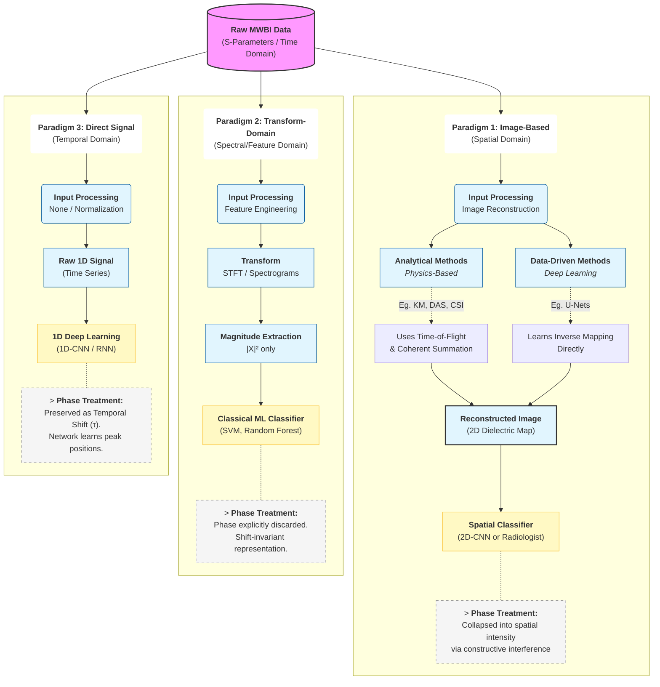

```mermaid
graph TD
    %% Global Input
    Input[("<b>Raw MWBI Data</b><br/>(S-Parameters / Time Domain)")]

    %% ==========================================
    %% PARADIGM 1: IMAGE-BASED
    %% ==========================================
    subgraph Para1 [" "]
        direction TB
        %% Title Node
        Title1("<b>Paradigm 1: Image-Based</b><br/>(Spatial Domain)")
        
        %% Connect Title to first step
        Title1 --> P1("<b>Input Processing</b><br/>Image Reconstruction")
        
        %% The Split in Reconstruction Methods
        P1 --> MethodA["<b>Analytical Methods</b><br/><i>Physics-Based</i>"]
        P1 --> MethodB["<b>Data-Driven Methods</b><br/><i>Deep Learning</i>"]
        
        %% Details of Methods
        MethodA -.->|Eg. KM, DAS, CSI| Physics["Uses Time-of-Flight<br/>& Coherent Summation"]
        MethodB -.->|Eg. U-Nets| DL_Recon["Learns Inverse Mapping<br/>Directly"]
        
        %% Re-merge to Image
        Physics --> Image["<b>Reconstructed Image</b><br/>(2D Dielectric Map)"]
        DL_Recon --> Image
        
        %% The Classification
        Image --> Class1["<b>Spatial Classifier</b><br/>(2D-CNN or Radiologist)"]
        
        %% Phase Treatment Note
        style Image stroke:#333,stroke-width:2px
        Note1["> <b>Phase Treatment:</b><br/>Collapsed into spatial intensity<br/>via constructive interference"]
        Class1 -.- Note1
        
        style Title1 fill:#fff,stroke:none,font-size:16px
    end

    %% ==========================================
    %% PARADIGM 2: TRANSFORM-DOMAIN
    %% ==========================================
    subgraph Para2 [" "]
        direction TB
        %% Title Node
        Title2("<b>Paradigm 2: Transform-Domain</b><br/>(Spectral/Feature Domain)")
        
        Title2 --> P2("<b>Input Processing</b><br/>Feature Engineering")
        
        %% The Process
        P2 --> Transform["<b>Transform</b><br/>STFT / Spectrograms"]
        
        %% The Critical Phase Loss Step
        Transform --> MagOnly["<b>Magnitude Extraction</b><br/>|X|² only"]
        
        %% The Classifier
        MagOnly --> Class2["<b>Classical ML Classifier</b><br/>(SVM, Random Forest)"]
        
        %% Phase Treatment Note
        Note2["> <b>Phase Treatment:</b><br/>Phase explicitly discarded.<br/>Shift-invariant representation."]
        Class2 -.- Note2

        style Title2 fill:#fff,stroke:none,font-size:16px
    end

    %% ==========================================
    %% PARADIGM 3: DIRECT SIGNAL
    %% ==========================================
    subgraph Para3 [" "]
        direction TB
        %% Title Node
        Title3("<b>Paradigm 3: Direct Signal</b><br/>(Temporal Domain)")
        
        Title3 --> P3("<b>Input Processing</b><br/>None / Normalization")
        
        %% The Process
        P3 --> RawSignal["<b>Raw 1D Signal</b><br/>(Time Series)"]
        
        %% The Classifier
        RawSignal --> Class3["<b>1D Deep Learning</b><br/>(1D-CNN / RNN)"]
        
        %% Phase Treatment Note
        Note3["> <b>Phase Treatment:</b><br/>Preserved as Temporal Shift (τ).<br/>Network learns peak positions."]
        Class3 -.- Note3

        style Title3 fill:#fff,stroke:none,font-size:16px
    end

    %% Main Connections (Forces the Tree Layout)
    Input --> Title1
    Input --> Title2
    Input --> Title3

    %% Styling
    classDef inputNode fill:#f9f,stroke:#333,stroke-width:2px;
    classDef processNode fill:#e1f5fe,stroke:#01579b;
    classDef classNode fill:#fff9c4,stroke:#fbc02d;
    classDef noteNode fill:#f5f5f5,stroke:#999,stroke-dasharray: 5 5;

    class Input inputNode;
    class P1,P2,P3,MethodA,MethodB,Transform,MagOnly,RawSignal,Image processNode;
    class Class1,Class2,Class3 classNode;
    class Note1,Note2,Note3 noteNode;
```
